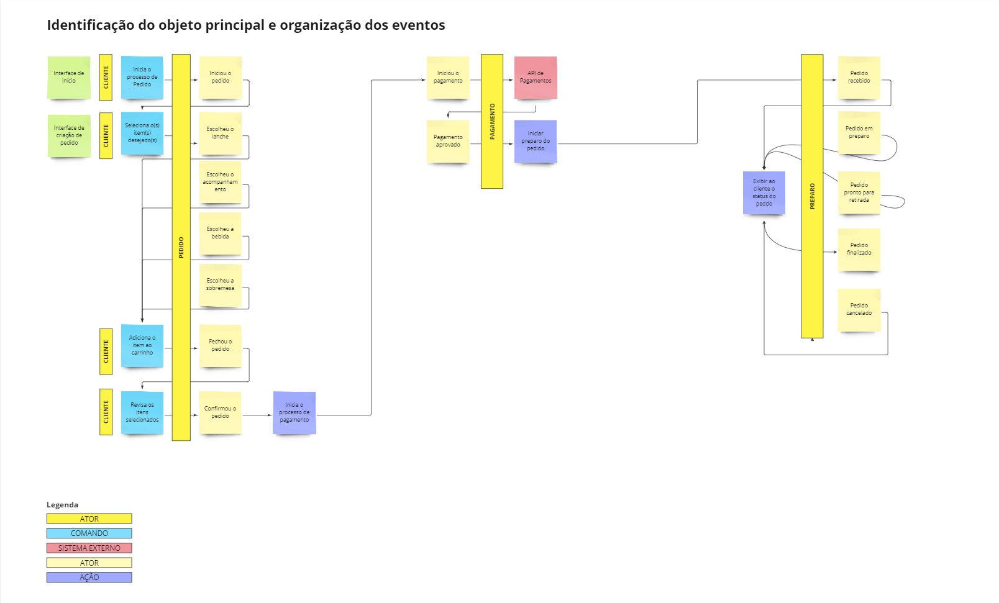

# Tech-Challenge - Grupo 38-7SOAT

Este é o projeto desenvolvido durante a fase I e atualizado durante a fase II do curso de pós-graduação em arquitetura de software da FIAP.

Membros do grupo:
* Ketlin Fabri dos Santos – RM35453
* Lucas Antonio dos Santos – RM354629
* Matheus Akio Santos Ishiguro – RM354952

## Propósito do projeto

Implementar um sistema de gerenciamento de pedidos para uma empresa do setor alimentício.

## Stack utilizada

* Node.js v18
* TypeScript
* Postgresql
* Docker
* Kubernetes


## Instalação do projeto

Este projeto está preparado para execução em um ambiente Docker. Portanto, será necessária apenas a instalação do Docker e/ou Kubernetes, sem a necessidade de instalar o projeto ou o banco de dados PostgreSQL manualmente.

Caso não tenha o Docker instalado, siga as instruções para seu sistema operacional na [documentação oficial do Docker](https://docs.docker.com/get-docker/).

# Como executar o projeto usando Kubernetes

- Fazer build da imagem Docker localmente com o comando abaixo:

```bash
❯ docker build -t tech-challenge:latest .
```

- Caso esteja usando o Kind (https://kind.sigs.k8s.io/) para os testes, execute os passos abaixo:

```bash
❯ kind create cluster --config=kind-api-cluster.yml
❯ kind load docker-image tech-challenge:latest --name kind
```

- Criar o deployment do database:

```bash
❯ kubectl apply -f database-configmap.yaml
❯ kubectl apply -f database-service.yaml
❯ kubectl apply -f database-deployment.yaml
```

> Observação: as tabelas são criadas automaticamente junto com os dados iniciais.

- Criar o deployment da aplicação:

```bash
❯ kubectl apply -f tech-challenge-configmap.yaml
❯ kubectl apply -f tech-challenge-service.yaml
❯ kubectl apply -f tech-challenge-deployment.yaml
❯ kubectl apply -f tech-challenge-hpa.yaml
```

- Para verificar se a aplicação está ativa, acesse: http://localhost:31000/api-docs
## Desenvolvimento do projeto

### Diagramas de fluxo

Foram utilizadas técnicas de Domain Driven Design para definição dos fluxos:

- Identificação do objeto principal e organização dos eventos


- Eventos Pivotais


- Diagrama de infraestrutura


- Requisitos de negócios


Todos os diagramas apresentados estão disponíveis no [Miro](https://miro.com/app/board/uXjVKUHWBkY=/?share_link_id=42148422473).

## Swagger
Todos os endpoints estão disponíveis para consulta via [Swagger](http://localhost:3000/api-docs/).
